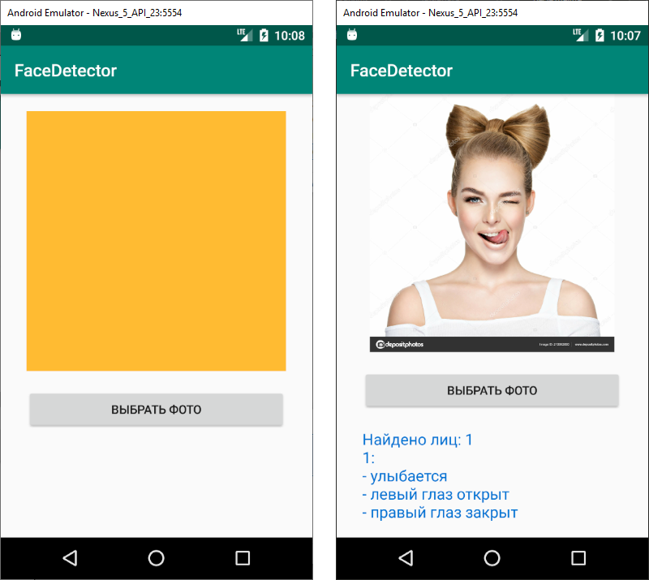

# FaceDetector
Android app for the face recognition powered by ML Kit for Firebase

## Screenshot

## HowTo

- [Add Firebase to your Android Project](https://firebase.google.com/docs/android/setup).
- Run the app on an Android device.

## Documentation

- [Read more about ML Kit for Firebase](https://firebase.google.com/docs/ml-kit/)

## Licence

  http://www.apache.org/licenses/LICENSE-2.0

Unless required by applicable law or agreed to in writing, software
distributed under the License is distributed on an "AS IS" BASIS, WITHOUT
WARRANTIES OR CONDITIONS OF ANY KIND, either express or implied.  See the
License for the specific language governing permissions and limitations under
the License.
